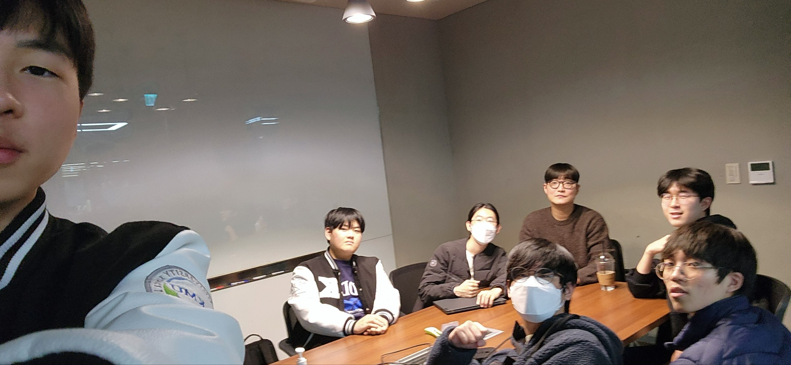

# 💡유레카프로젝트 14조💡
*by 김범진, 김원영, 박선우, 박정용, 이원준, 임시원*

<h1><mark>슬로건</mark></h1>

>  **"지지자불여호지자, 호지자불여락지자"**

➡️ 유레카프로젝트 활동을 즐기자!

<h2><mark>진행한 활동</mark></h2>

    
3,4학년 과목 담당 교수님 사인

- 팀의 관심사 중 <b>임베디드 시스템</b>에 대해 알아보려고 함  
    Q. 교수님께서 '임베디드시스템설계' 과목을 담당하시는 걸로 알고 있는데, 어떤 과목인지 그리고 어떤 학생이 수강하면 좋은지 궁금합니다. 
    A. 전반적으로 컴퓨터가 동작하는 원리를 깊이 이해하는 과목입니다. 컴퓨터를 시스템 부분에서 폭넓게, 깊게 이해하고 싶은 학생이 수강하면 좋습니다.

    
교수님 사인

- 팀의 관심사 중 <b>대학원 진학</b>에 대해 알아보려고 함  
    Q. 대학원에 가려면 어떻게 준비해야 할까요? 컴퓨터 비전, NLP 등을 공부했는데 대학원을 가야한다고 들어서 고민이 많습니다. 
    A. 우선 성적 관리를 잘 하세요. 국민대 대학원으로 진학하면 학,석사 통합 과정을 염두에 두셔도 좋고, 타 대학원으로 갈 생각이라면 미리 조사를 해두는게 좋습니다. 대학원 진학 자체는 어려운 편이 아니니 교수님과 연구실에 관해서 미리 알아보는 것이 중요합니다.

    
행정실 사인

- 팀의 관심사 중 <b>GREAT Program</b>에 대해 알아보려고 함  
    Q. 저희 뿐만이 아니라 많은 학생들이 GREAT Program에 관심이 많은데요, GREAT Program에 참여하기 위해 준비해야 할 점은 뭐가 있을까요? 
    A. 우선 코딩 테스트를 보기 때문에 코딩 테스트에 대한 준비는 필수입니다. 또한 인성 면접 및 영어 면접이 있기 때문에 면접 준비도 해야합니다. 영어 면접의 경우 절대적인 영어 실력을 보기 보다는 대화 능력을 주로 보기 때문에 본인의 열정을 드러내는 것이 중요합니다.

    
멘토링

- 팀원 <b>개개인의 진로</b>에 대해 알아보려고 함  
    Q. 막연히 개발자가 되고 싶다는 생각으로 이 학과에 입학했지만 아직 명확한 방향성을 잡지 못했습니다. 인공지능 분야에 관심이 있긴 하지만 정확히 어떤 내용을 공부해야 할지 잘 모르겠습니다. 
    A. 일단 본인이 가장 관심 있는 분야를 깊이 공부하는 것을 추천드립니다. 너무 많은 내용들만 얕게 다룰 줄 아는 것 보다는 하나라도 확실히 할 줄 아는 것이 있는 것이 낫다고 생각합니다. 아직 1학년이기도 하고 나중에 다른 분야로 전환해도 괜찮으니 하나를 깊게 파고들어 보세요.

    
학과 서비스 및 서버실 탐방

- 팀의 관심사 중 <b>인공지능</b>에 대해 알아보려고 함  
    Q. 딥러닝에 GPU가 사용되는 이유가 무엇인가요? 
    A. 딥러닝은 대량의 행렬 연산을 포함하므로, 병렬 처리가 뛰어난 GPU가 CPU보다 훨씬 빠르게 계산을 처리할 수 있기 때문입니다.

    
보직 교수님 사인

- 팀의 관심사 중 <b>다중전공</b>에 대해 알아보려고 함  
    Q. 다중전공을 하는 데 있어서 어떤 전공을 경험하는 것이 도움이 될까요? 
    A. 본인의 관심 있는 분야의 전공을 경험하는 것이가장 중요합니다. 최근에는 의료 관련 시장이 유망하다고 생각합니다.

    
대학원생 사인1

- 팀의 관심사 중 <b>컴퓨터 비전</b>에 대해 알아보려고 함  
    Q. 컴퓨터 비전 분야의 전망을 어떻게 보시나요? 
    A. 컴퓨터 비전이 쓰이기 시작한 시점부터 우리 인간에게 필수불가결인 존재가 되었다고 생각합니다. 국방과 방산에는 아직 컴퓨터 비전이 많이 도입이 되지 않았고 많이 도입을 하려고 많은 사업과 소요가 제기 되고 있어서 국방과 방산 분야에서는 점차 더 많은 무기체계, 방어체계에 사용 될 것으로 생각됩니다. 민간에서도 제도와 법이 일정 부분 개정이 된다면 의료 분야, 보안 분야, 안전 분야 등에서 많이 도입이 될 것으로 생각합니다.

    
대학원생 사인2

- 팀의 관심사 중 <b>컴퓨터 비전</b>에 대해 알아보려고 함  
    Q. 인공지능 분야는 석사가 필수라고 들었는데, 어떤걸 준비하면 좋을지 알 수 있을까요? 
    A. 학부 과정에서는 영어, 수학 공부를 해두는 것을 추천드립니다. 코드에도 친숙해져야합니다. 정말 이 분야에 관심이 있다면 학부연구생 경험도 좋습니다. 추가적인 조언을 드리자면 성적은 3.7 정도로 유지하세요.

    
정통처 탐방

- 팀의 관심사 중 <b>네트워크</b>에 대해 알아보려고 함  
    Q. DR시스템이 안전성 외에 효율성도 있는지 궁금합니다. 
    A. DR시스템을 구축하는데 추가적인 비용이 발생하지는 않으므로 무한대의 효율을 낼 수 있습니다.

<h2><mark>소감 및 각오</mark></h2>

**김범진**
> 내가 무엇을 하고싶은지 생각해보고, 그리고 무엇을 할지 방향을 잡아볼수 있는 과정이였다. 너무 나중 걱정하기 보단 지금수준에서 할수 있는 일을 열심히 하고싶다. 결국 1학년은 이것저것 다 해보라는 말만이 남았다.

**김원영**
> 유레카프로젝트 과목 첫 시간에 해야할 활동이 너무 많아 귀찮다는 생각이 들었지만, 활동을 진행하는 시간들이 전혀 아깝지 않았다. 교수님께서 조언 해주신대로 시야는 넓게, 공부는 깊게 해야겠다고 생각했다.

**박선우**
> 처음 커리큘럼에서 접했을 당시 생각했던 것보다 유익한 시간이었다. 1학점 이상의 값어치를 하는 수업과 경험들이었다. 꿈의 방향이 명확해 지고 있기 때문에 꿈에 다가가기 위해 내가 할 수 있는 것들에 최선을 다해보고자한다.

**박정용**
> 1학년이라면 궁금해할법한 내용들을 한 학기 동안 조별로 활동하며 알아갈 수 있어 좋았다. 특히 교수님들과의 인터뷰 시간에 많은 것을 얻어간 것 같아서 유익했다.

**이원준**
> 걱정했던 것보다 얻어간 내용이 많았던 수업이었다. 소융대의 교과과정을 알아보면서 앞으로 뭘 공부해야할지 알게되었다. 진로의 방향성에 대해 끊임없이 고민해야겠다는 생각이 들었다.

**임시원**
> 내 진로에 대해서 방황하고 고민도 많은 시기를 겪고 있었는데, 유레카프로젝트 활동을 통해서 나름 방향성을 얻게 된거 같아서 좋았다. 우선 내가 가장 관심 있는 분야의 공부를 열심히 해야겠다.
